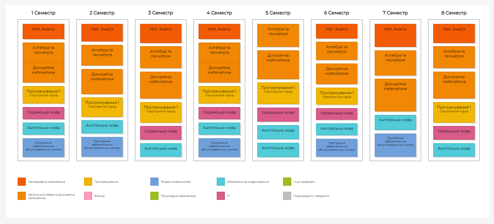

# Сurriculum prettifier
Generator of pretty tables written in HTML/CSS/Javascript. JSDoc documentation in the index.html

- Main panel width - 100em
- Term width (with padding) - 12.5em *(because we have 8-term curriculums)*
- Subject height - calculated as `max_term_height * (subj.credits/term.total_credits)` (development in progress, now height difference is too subtile)

